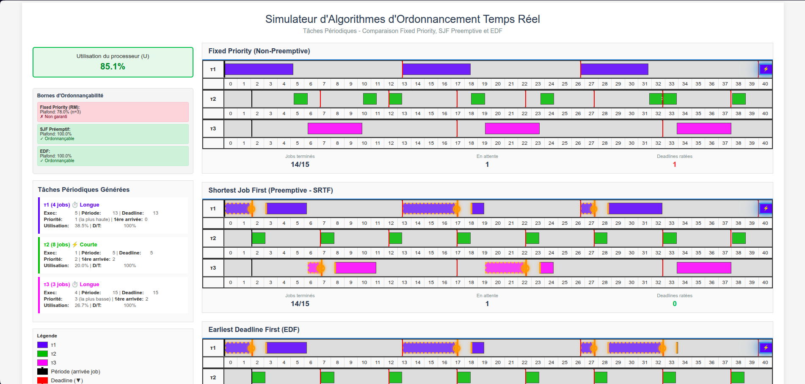
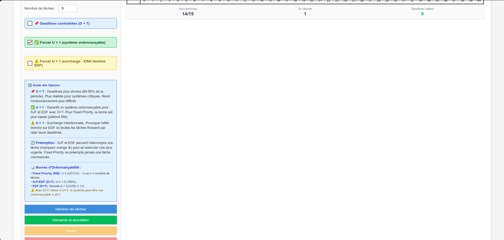

# Simulateur d'Ordonnancement Temps Réel

Un simulateur interactif pour visualiser et comparer les algorithmes d'ordonnancement temps réel : **Fixed Priority**, **SJF Préemptif** et **EDF**.


---

## 🎯 Aperçu

Ce projet est un simulateur pédagogique développé dans le cadre d'un exposé sur l'ordonnancement temps réel. Il permet de :

- 📊 **Visualiser** l'exécution de tâches périodiques en temps réel
- ⚖️ **Comparer** 3 algorithmes classiques côte à côte
- 🔍 **Analyser** les bornes d'ordonnançabilité (Rate Monotonic, densité EDF)
- 🎨 **Observer** les préemptions et deadlines manquées en direct




---

## 🚀 Démarrage Rapide

### Installation

Aucune installation nécessaire ! Téléchargez simplement le fichier HTML et ouvrez-le dans votre navigateur.

```bash
# Cloner le repository
git clone https://github.com/votre-username/scheduling-simulator.git

# Ouvrir le simulateur
cd scheduling-simulator
open scheduling-simulator-professional.html
```

### Utilisation

1. **Générer** un jeu de tâches aléatoires
2. **Configurer** les options (deadlines contraintes, utilisation CPU)
3. **Lancer** la simulation
4. **Observer** les 3 algorithmes en action !

---

## ✨ Fonctionnalités

### 🎮 Visualisation Interactive

- **Diagrammes de Gantt** en temps réel pour chaque algorithme
- **Marqueurs visuels** : arrivées (▲), deadlines (▼), préemptions (⊗)
- **Code couleur** : exécution normale vs. deadline ratée (rouge)
- **Contrôles** : Pause, reprise, réinitialisation

### 📐 Bornes d'Ordonnançabilité

Le simulateur calcule et affiche automatiquement :

- **Fixed Priority (RM)** : U ≤ n(2^(1/n) - 1)
- **SJF Préemptif** : U ≤ 100%
- **EDF** :
  - D = T : U ≤ 100%
  - D < T : Δ = Σ(Ci/Di) ≤ 100% (test de densité)

### 🔬 Modes de Test

- **U < 1** : Système ordonnançable garanti (avec D = T)
- **U > 1** : Surcharge intentionnelle (effet domino)
- **D < T** : Deadlines contraintes (cas réaliste)

---

## 📚 Documentation

- **[Guide d'Utilisation](GUIDE_UTILISATION.md)** - Pas à pas pour utiliser le simulateur
- **[Corrections Techniques](CORRECTIONS_ET_AMELIORATIONS.md)** - Détails des bugs corrigés
- **[Présentation PDF](Presentation_EDF_Scheduling.pdf)** - Support de notre exposé

---

## 🎓 Contexte Académique

Ce simulateur a été développé dans le cadre d'un projet universitaire sur l'ordonnancement temps réel.

### 📖 Références Théoriques

- **Liu & Layland (1973)** - "Scheduling Algorithms for Multiprogramming in a Hard-Real-Time Environment"
  - Théorème Rate Monotonic
  
- **Dertouzos (1974)** - "Control Robotics: The Procedural Control of Physical Processes"
  - Théorème EDF (optimalité)
  
- **Baruah, Mok & Rosier (1990)** - "Preemptively Scheduling Hard-Real-Time Sporadic Tasks"
  - Test de densité pour D ≤ T

---

## 👥 Contributeurs

Ce projet a été réalisé en collaboration avec :

- **[@contributeur1-github](https://github.com/contributeur1)** - Recherche théorique et validation des algorithmes
- **[@dric2000](https://github.com/dric2000)** - Documentation et Mise en place de la présentation
- **[@WesleyEliel](https://github.com/WesleyEliel)** - Développement et implémentation

Un grand merci à mes camarades pour leur aide précieuse ! 🙌

---

## 🛠️ Technologies

- **React 18** - Framework UI
- **JavaScript ES6+** - Logique des algorithmes
- **CSS3** - Animations et mise en page
- **HTML5** - Standalone, aucune dépendance

**Compatibilité :** Chrome, Firefox, Safari, Edge (versions récentes)

---

## 🎯 Points Clés Techniques

### Détection des Deadlines Ratées

Le simulateur divise chaque exécution en **segments** (en cas de préemption) et vérifie pour chaque segment si la deadline est dépassée :

```javascript
const hasMissedDeadline = state.segments.some(segment => {
    const segmentEnd = segment.startTime + segment.duration;
    return segmentEnd > job.deadline;
});
```

### Test de Densité (D < T)

Quand les deadlines sont contraintes (D < T), le théorème de Dertouzos ne s'applique plus. On utilise alors le test de densité :

```javascript
const density = tasks.reduce((sum, task) => 
    sum + (task.executionTime / task.relativeDeadline), 0
);
// Ordonnançable si density ≤ 1.0
```

**Exemple concret :** Un système avec U = 97.9% peut être **non ordonnançable** si Δ > 100% !

---

## 📊 Exemple de Résultat

```
Utilisation : 97.9%

Fixed Priority (RM):
  Plafond : 75.7% (n=4)
  ✗ Non garanti (97.9% > 75.7%)

SJF Préemptif:
  Plafond : 100%
  ✓ Ordonnançable

EDF:
  Plafond : 100%
  Densité (Δ) : 159%
  ✗ Non ordonnançable
  ⚠️ D < T : Δ > 1
```

---

## 🤝 Contribuer

Les contributions sont les bienvenues ! Voici quelques pistes d'amélioration :

- [ ] Test de demande processeur (plus précis que la densité)
- [ ] Support des tâches apériodiques
- [ ] Export CSV des résultats
- [ ] Mode pas à pas interactif
- [ ] Traduction anglaise

**Pour contribuer :**
1. Fork le projet
2. Créez une branche (`git checkout -b feature/amelioration`)
3. Commit vos changements (`git commit -m 'Ajout fonctionnalité X'`)
4. Push vers la branche (`git push origin feature/amelioration`)
5. Ouvrez une Pull Request

---

## 📝 License

Ce projet est fourni à des fins académiques. Libre d'utilisation pour l'enseignement et la recherche.

---

## 🔗 Liens Utiles

- **[Demo Live](#)** - Essayez le simulateur en ligne
- **[Issues](https://github.com/votre-username/scheduling-simulator/issues)** - Signaler un bug
- **[Wiki](#)** - Documentation approfondie

---

## 📧 Contact

Pour toute question :
- Ouvrez une [issue](https://github.com/votre-username/scheduling-simulator/issues)
- Consultez le [guide d'utilisation](GUIDE_UTILISATION.md)

---

**Développé avec ❤️ pour comprendre l'ordonnancement temps réel**

*Dernière mise à jour : Novembre 2025*
